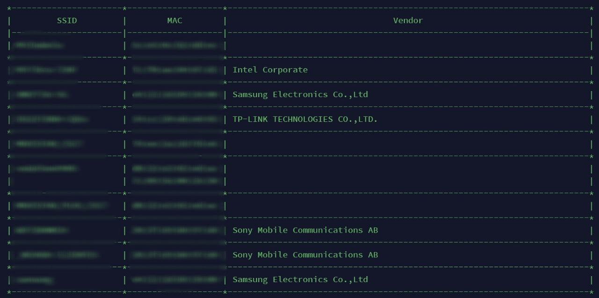

# Probe Radar
This tool is able to capture probe request packets generated by client stations by sniffing 802.11 traffic and filtering by managed packaged with the subtype 0x4 which corresponds to probe request packages. Also it has a mac addresses dictionary obtained from [aallan repo](https://gist.github.com/aallan/b4bb86db86079509e6159810ae9bd3e4).



## Dependencies
- Python3
- Scapy python3 library

## Usage
It is very easy to use this tool, just be sure that you have a wireless card which supports monitor mode and execute the following command.

```
python3 proberadar.py <INTERFACE>
```

Probe radar will set the interface to monitor mode and start sniffing probe requests until you press ```CTRL+C``` and the tool will stop, restore interface to managed mode and exit.

It is also possible to save the sniffed information into a json file just executing the following command.

```
python3 proberadar.py <INTERFACE> <FILE>.json
```

## Comming soon
- It is intended to add wigle compatibilty, which will try to geo locate captured APs.
- OSX support is in progress.